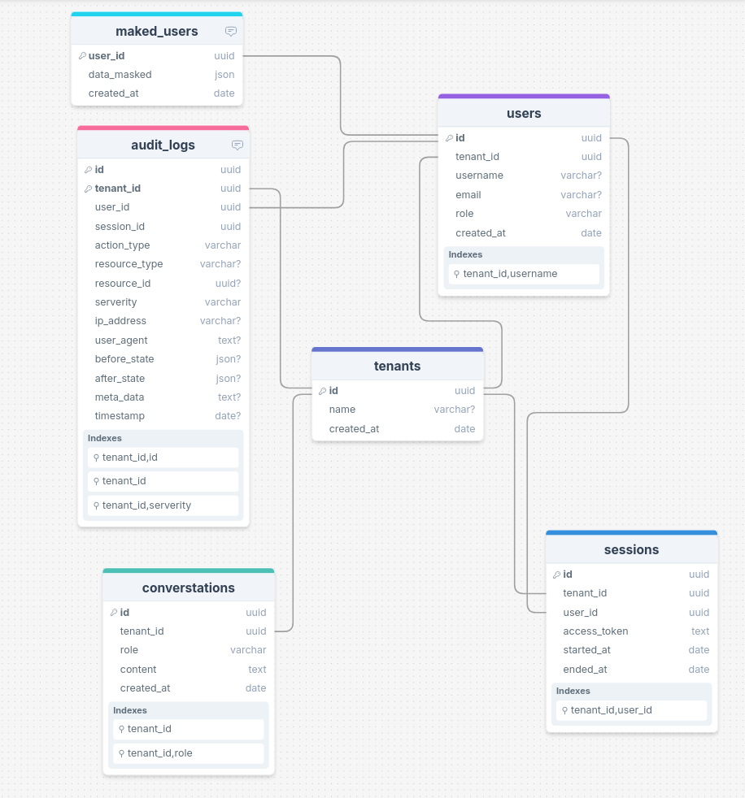
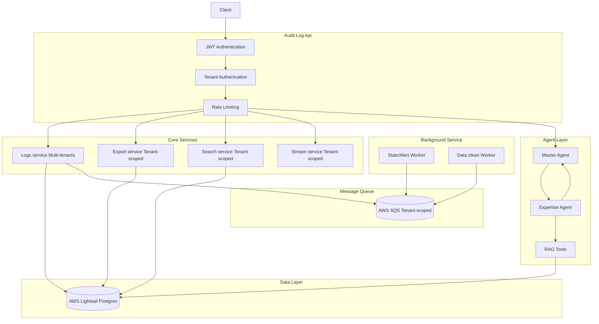

## Audit Log API System

To enable administrators to query audit logs seamlessly across any platform, I built a high-throughput, secure Audit Log API system. The design goals were:

- **Scalability**: Handle large volumes of concurrent queries with minimal latency  
- **Security**: Enforce authentication, authorization, and rate-limiting at every layer  
- **Portability**: Deployable via containers on any cloud or on-prem environment

---
## Demo Deployment
- The APIs document (Swagger) is deployed at [here](https://travist-audit-log-api.orangecoast-1a9ad26f.southeastasia.azurecontainerapps.io/docs)
- [WIP] The Streamlit Dashboard is deployed at [here]()

---
## API usage instruction

- To use the core APIs listed below, you must first obtain a valid access token. Access tokens are time-limited and automatically expire when their validity period ends.
- To generate an access token, you’ll need to create a user account associated with a specific tenant.
- Currently, I have three sample tenants available: Resola, KMS, and AIAIVN. After creating a user under one of these tenants, request an access token using that user’s credentials.
- Finally, include the newly issued token in your requests to authorize and interact with the APIs.
---
## How to set up
- Please config the `.env` with given sample keys in `sample.env` to run this repo.
```bash
# (optional) instal virtual envs, it require version of python
conda create --name yourenv python==3.11
conda actiate yourenv

# install env package
git clone https://github.com/thinhsuy/audit-log-api.git
cd audit-log-api

# install and start API
pip install poetry
poetry config virtualenvs.create false
cd api && poetry install
cd api/core && python main.py
```

---

### Repository Layout

```bash
audit-logs/
├── .gitignore
├── docker-compose.yml        # Defines multi-container setup (API, Nginx, etc.)
├── api/
│   ├── core/
│   │   ├── agent/            # LLM / tool integrations
│   │   ├── data/             # Static lookup tables and JSON fixtures
│   │   ├── database/         # ORM models and CRUD operations
│   │   ├── routes/           # API route definitions
│   │   ├── schemas/          # Pydantic models for request/response and DB tables schemas
│   │   ├── services/         # Business logic and external service adapters
│   │   ├── test/             # Unit- and integration-tests with pytest
│   │   ├── app.py            # FastAPI application factory
│   │   ├── config.py         # Environment-based configuration loader
│   │   └── limiter.py        # Rate-limit middleware setup
│   ├── main.py               # Entry point for running the API server
│   ├── pyproject.toml        # Poetry project file
│   ├── Dockerfile            # Container image definition for the API
│   └── deployment.sh         # Deployment script (CI/CD integration)
├── logs/                     # Directory for persisted log files (if any)
└── ui/
    ├── core/
    │   └── main.py           # Streamlit dashboard for real-time monitoring
    ├── pyproject.toml        # Poetry config for UI service
    └── Dockerfile            # Container image for Streamlit UI
```

---

### API Design

To ensure a robust, secure, and highly scalable Audit Log API, I adopted the following design principles and technologies:


- **Authentication**  
  Every request must present a short-lived **access token** generated at login. Tokens are issued per `tenant_id` and `user_id`, and encapsulate:
  - The current tenant and user identity
  - Token expiration (configurable TTL)  
  Tokens are signed and optionally encrypted to prevent tampering.

- **Authorization & Role-Based Access Control (RBAC)**  
  Each access token carries a **role claim** (`Admin`, `User`, or `Auditor`).  
  - **Admin**: Full CRUD on logs and system configuration  
  - **User**: Create and query logs within their own tenant scope  
  - **Auditor**: Read-only access across all logs of a tenant

- **Rate Limiting**  
  To protect downstream systems and meet performance targets:
  - **Log-related routes** are capped at **10,000 requests/min** (load-tested for high throughput)  
  - **Non-log routes** are limited to **100 requests/min**  

- **Request & Response Validation**  
  All endpoints use **Pydantic** models to declare:
  - Required and optional fields in the request payload  
  - Field types, formats, and value constraints  
  - Response schemas for consistent API contracts  
  This ensures early rejection of malformed data and auto-generated OpenAPI documentation.

- **Error Handling**  
  - Business logic errors raise `HTTPException` with meaningful status codes and error messages  
  - Unhandled exceptions are caught by a global error handler, which logs the incident and returns a sanitized 5xx response

- **Search Integration**  
  Rather than a generic text index (e.g., OpenSearch), I integrated a **Smart Chatbot Agent** for natural-language log searches.  
  - Allows complex queries like “Show all ERROR logs for tenant X between 2025-07-01 and 2025-07-24”  
  - Leverages LLM-powered intent parsing to translate user queries into optimized database filters

- **Multi-Tenancy**  
  Each request is scoped by its access token, which encodes the tenant context.  
  - All database queries automatically filter by `tenant_id`  
  - Tokens are rotated per session to minimize risk  
  - Encryption of tenant claims prevents cross-tenant data leaks

---

### Database Design
- **Database Platform**  
  I chose Amazon Lightsail’s managed PostgreSQL (1 GB RAM, 2 vCPUs) for its cost-effective, fully managed environment and predictable performance.



- **Schema Optimization**  
  To minimize complex joins and streamline query paths, the schema consists of six core tables:
  - `audit_logs` – Stores every user action, scoped by tenant
  - `tenants` – Maintains tenant metadata and configuration  
  - `users` – Holds user profiles, each tied to a specific tenant  
  - `sessions` – Tracks login sessions and service usage events  
  - `conversations` – Captures per-tenant chatbot dialog history  
  - `mask_users` – Archives masked user records for privacy-compliant access

- **Indexing Strategy**  
  I created B-tree indexes and composition indexes on all high-cardinality and filterable columns—such as `tenant_id`, `user_id` and `timestamp`.

- **Partitioning**  
  Implemented declarative partitioning on the `audit_logs` table by `tenant_id`. This allows:
  - Efficient data pruning and archival per tenant  
  - Improved I/O locality for tenant-specific queries  

- **Connection Pooling**  
  Given the modest Lightsail instance, I tuned the DB driver’s pool settings to:
  - **Pool size**: 5  
  - **Max overflow**: 10  
  - **Connection timeout**: 30 seconds

- **Triggers & Data Masking**  
  For both `audit_logs` and `users`, I defined DDL triggers to:
  1. Automatically mask sensitive fields on INSERT/UPDATE  
  2. Archive the original (unmasked) payload into a restricted `mask_users` table

---

### Security

- **Data Encryption**  
   Sensitive log payloads (e.g. `meta_data`) are encrypted using AES-GCM before transit and at rest.

- **Fine-Grained Access Control**  
  Every request must present a JWT access token scoped to a single `tenant_id` and `user_id`. Tokens carry role claims (`Admin`, `User`, `Auditor`) and expire after a configurable TTL. FastAPI dependency injections validate token signatures which could decoded into roles, and tenant context on each route.
  - `Admin`: have full access on every APIs
  - `User`: have access on CRUD
  - `Auditor`: have access on Read-Only

- **Database-Level Data Masking**  
  PostgreSQL triggers automatically mask PII on INSERT/UPDATE into the `users` table. The original unmasked records are vaulted to a restricted `mask_users` table accessible only by audit-compliant processes. This ensures live queries never expose raw sensitive data.

---

### Services Deployed

- **Containerized Microservices**  
  - **Azure Container Instances (ACI)** deploy the FastAPI backend and Streamlit UI as Docker containers.  
  - Images are built via `Dockerfile` and stored in Azure Container Registry (ACR).

- **Database Hosting**  
  - AWS Lightsail PostgreSQL (1 GB RAM, 2 vCPU) provides a cost-effective, managed relational store.  
  - Backups and automated minor version upgrades are configured via Lightsail console.

- **Message Queue & Background Processing**  
  - AWS SQS handles background jobs (e.g., stats caluclation, alert dispatch).  
  - Worker processes (Celery or FastAPI background tasks) consume SQS messages to perform asynchronous actions and trigger alerts.

---

### Additional Feature: Chatbot Agent System

To enable natural-language querying over audit data, I integrated an AI-driven Agent subsystem:

1. **Retrieval-Augmented Generation (RAG)**  
   - A lightweight vector store indexes recent logs; semantic embeddings allow similarity searches and pandas dataframe smart logics retrieve data algorithm. 
   - Upon user query, relevant log fragments are retrieved and passed to an LLM prompt.

2. **Agent-to-Agent Chains of Thought**  
   - I orchestrate multiple agent roles (e.g., MasterAgent, RetrievalAgent).  
   - Each agent processes structured payloads, applies business rules, and hands off context—ensuring accurate, auditable responses.

---

### System Architecture


1. **JWT Authentication**  
   Every incoming HTTP request carries a signed JSON Web Token. FastAPI’s dependency layer verifies the token signature, extracts the `tenant_id` and `user_role`, and rejects any malformed or expired tokens.

2. **Tenant & Role Validation**  
   Once the JWT is validated, a second check ensures that the token’s tenant context matches the target tenant (Tenant Authentication). The user’s role (`Admin`, `User`, or `Auditor`) is then enforced via FastAPI dependencies to gate access to each route.

3. **Rate Limiting**  
   Validated requests enter our rate-limiting middleware (`limiter.py`), which uses a dependency algorithm of `slowapi` to throttle.

4. **Router Dispatch & Database Access**  
   Approved requests are dispatched to the appropriate FastAPI router. Each handler uses SQLAlchemy to query the AWS Lightsail PostgreSQL instance.

5. **Background Task**  
   For endpoints that trigger asynchronous work (e.g., log aggregation or cleanup), the service publishes messages to a tenant-scoped AWS SQS queue. Dedicated workers consume these messages to run:

6. **Natural-Language Query Handling (Agent System)**  
   If a user submits a conversational query:
   - The **Master Agent** parses intent and routes the request to an **Expertise Agent**.  
   - The Expertise Agent executes a Retrieval-Augmented Generation (RAG) pipeline—using a vector store of recent logs—and performs DataFrame operations (via Pandas) to filter, aggregate, and analyze results.  
   - Once processing completes, the Master Agent formats the answer and returns a human-readable response.