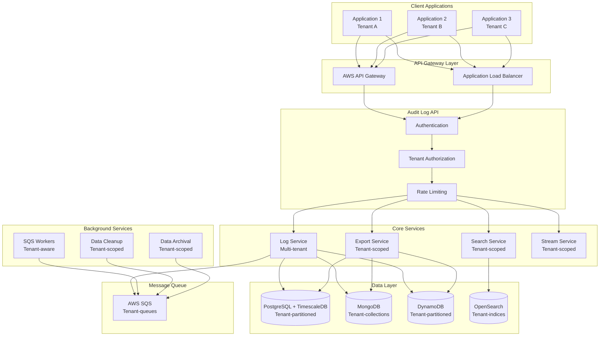
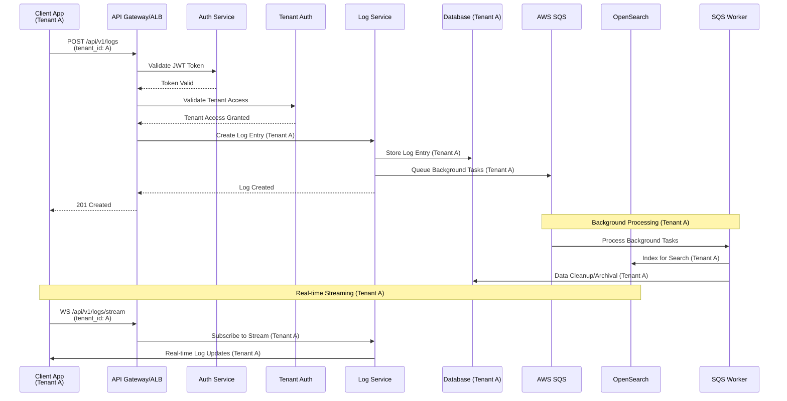

# Code Challenge: Audit Log API

## Objective

Develop a comprehensive audit logging API system that tracks and manages user actions across different applications. This system should be designed to handle high-volume logging, provide search and filtering capabilities, and ensure data integrity and security.

## Requirements:

### Core Features:

#### Audit Log Management:
- **Log Entry Creation**: API endpoints to create audit log entries with metadata
- **Structured Data**: Each log entry should include:
  - User ID and session information
  - Action performed (CREATE, UPDATE, DELETE, VIEW, etc.)
  - Resource type and ID (e.g., "user", "order", "product")
  - Timestamp with timezone
  - IP address and user agent
  - Before/after state changes (for modifications)
  - Custom metadata fields
  - Severity level (INFO, WARNING, ERROR, CRITICAL)
  - **Tenant ID**: Multi-tenant support for multiple applications/organizations

#### Search and Retrieval:
- **Advanced Search**: Filter logs by date range, user, action type, resource type, severity, **tenant ID**
- **Full-text Search**: Search through log messages and metadata
- **Pagination**: Handle large result sets efficiently
- **Export Functionality**: Export logs in JSON, CSV formats
- **Real-time Log Streaming**: WebSocket endpoint for real-time log monitoring
- **Tenant Isolation**: Ensure complete data isolation between tenants

#### Data Management:
- **Data Retention**: Configurable retention policies (e.g., keep logs for 90 days)
- **Data Archival**: Move old logs to cold storage
- **Data Compression**: Efficient storage for large log volumes
- **Backup and Recovery**: Automated backup procedures

### Technical Requirements:

#### API Design:
- **API Gateway**: Choose between AWS API Gateway or Application Load Balancer based on requirements
- **RESTful API** following OpenAPI 3.0 specification
- **Authentication**: JWT-based authentication
- **Authorization**: Role-based access (Admin, Auditor, User) with **tenant-based access control**
- **Rate Limiting**: Prevent API abuse
- **Request Validation**: Input sanitization and validation
- **Error Handling**: Proper HTTP status codes and error messages
- **Search Integration**: OpenSearch for advanced search capabilities
- **Multi-tenancy**: Support for multiple tenants with complete data isolation

#### Database Design:
- **Database Choice**: Select one of the three options based on your preference and requirements:
  - **PostgreSQL + TimescaleDB**: Optimized for time-series data with efficient partitioning
  - **MongoDB**: Document-based storage with flexible schema for audit logs
  - **DynamoDB**: Serverless NoSQL with automatic scaling and built-in encryption
- **Multi-tenant Schema**: Design schema to support multiple tenants with proper isolation
- **Optimized Schema**: Design for high-volume writes and complex queries based on your chosen database
- **Indexing Strategy**: Efficient indexes for search operations (database-specific) including tenant-based indexes
- **Data Partitioning**: Consider time-based and tenant-based partitioning for large datasets
- **Connection Pooling**: Handle concurrent requests efficiently

#### Performance:
- **High Throughput**: Handle 1000+ log entries per second
- **Low Latency**: Sub-100ms response times for search queries
- **Message Queue**: AWS SQS for background task processing and data archival
- **Async Processing**: Background tasks for data archival and cleanup using SQS

#### Security:
- **Data Encryption**: Encrypt sensitive log data at rest
- **Access Control**: Fine-grained permissions for log access with tenant isolation
- **Audit Trail**: Log access to the audit logs themselves
- **Data Masking**: Mask sensitive information in logs (PII, passwords)
- **Tenant Isolation**: Complete data isolation between tenants at all levels
- **Cross-tenant Protection**: Prevent data leakage between tenants

### Implementation Details:

#### Technology Stack:
- **Framework**: Django or FastAPI
- **API Gateway**: Choose one of:
  - **AWS API Gateway** (for serverless, managed API management)
  - **Application Load Balancer (ALB)** (for traditional load balancing)
- **Database**: Choose one of:
  - **PostgreSQL** with TimescaleDB extension (for time-series data)
  - **MongoDB** (for document-based storage)
  - **DynamoDB** (for serverless, scalable NoSQL)
- **Message Queue**: AWS SQS for background task processing
- **Search**: OpenSearch (optional, for advanced search capabilities)

#### API Endpoints:
```
POST   /api/v1/logs                    # Create log entry (with tenant ID)
GET    /api/v1/logs                    # Search/filter logs (tenant-scoped)
GET    /api/v1/logs/{id}              # Get specific log entry (tenant-scoped)
GET    /api/v1/logs/export            # Export logs (tenant-scoped)
GET    /api/v1/logs/stats             # Get log statistics (tenant-scoped)
POST   /api/v1/logs/bulk              # Bulk log creation (with tenant ID)
DELETE /api/v1/logs/cleanup           # Cleanup old logs (tenant-scoped)
WS     /api/v1/logs/stream            # Real-time log streaming (tenant-scoped)
GET    /api/v1/tenants                # List accessible tenants (admin only)
POST   /api/v1/tenants                # Create new tenant (admin only)
```

#### System Architecture:


#### Audit Log Flow:


### Testing:

- **Unit Tests**: >85% code coverage
- **Integration Tests**: API endpoint testing
- **Performance Tests**: Load testing with realistic data volumes
- **Security Tests**: Authentication and authorization testing

### Documentation:

- **API Documentation**: OpenAPI/Swagger documentation
- **Setup Instructions**: Clear deployment and configuration guide
- **Architecture Diagram**: System design and data flow
- **Code Documentation**: Inline comments and docstrings

### Bonus Features (Optional):

- **Alert System**: Configure alerts for specific log patterns
- **Dashboard**: Simple web interface for log visualization
- **Log Analytics**: Basic analytics and reporting
- **Log Correlation**: Group related log entries by request ID

### Submission:

- **Git Repository**: Clean, well-structured code
- **README**: Comprehensive setup and usage instructions
- **API Documentation**: Complete endpoint documentation
- **Postman Collection**: Test the API endpoints
- **Architecture Diagram**: System design overview
- **Live Demo**: Deployed application (optional)

### Evaluation Criteria:

#### Code Quality & Architecture (30%):
- **Code Structure**: Clean, maintainable, and well-structured code
- **API Design**: RESTful principles, proper error handling, validation
- **Database Design**: Efficient schema design and query optimization with multi-tenant support
- **Multi-tenancy**: Proper implementation of tenant isolation and access control
- **Technical Decisions**: Justification of technology choices and architecture

#### Performance & Scalability (25%):
- **High Throughput**: Ability to handle 1000+ log entries per second
- **Low Latency**: Sub-100ms response times for search queries
- **Message Queue**: Effective use of AWS SQS for background processing
- **Database Optimization**: Efficient design and query performance for chosen database

#### Security & Compliance (20%):
- **Authentication**: Proper JWT-based authentication implementation
- **Authorization**: Role-based access control and fine-grained permissions with tenant isolation
- **Data Protection**: Encryption at rest and in transit
- **Input Validation**: Proper sanitization and validation of all inputs
- **Tenant Isolation**: Complete data isolation between tenants

#### Testing & Documentation (15%):
- **Test Coverage**: >85% code coverage with comprehensive testing
- **API Documentation**: Complete OpenAPI/Swagger documentation
- **Setup Instructions**: Clear deployment and configuration guide
- **Code Documentation**: Inline comments and comprehensive docstrings

#### Problem Solving & Innovation (10%):
- **Complex Requirements**: Ability to handle complex requirements efficiently
- **Creative Solutions**: Innovative approaches to technical challenges
- **Database Choice**: Justification and implementation of chosen database technology
- **API Gateway Choice**: Selection and implementation of API Gateway or ALB
- **SQS Integration**: Effective use of AWS SQS for background processing
- **OpenSearch Integration**: Implementation of advanced search capabilities
- **Multi-tenancy**: Effective implementation of tenant isolation and access control
- **Bonus Features**: Implementation of optional advanced features
- **Performance Optimization**: Creative solutions for performance challenges

## Timeline:

This challenge is designed to be completed in **3-5 business days**:

#### **Days 1-2: Core API Development**
- Set up project structure and technology stack
- Choose and configure database (PostgreSQL/MongoDB/DynamoDB)
- Set up API Gateway or ALB
- Implement core audit log management features
- Design and implement database schema
- Create basic API endpoints
- Set up AWS SQS for background processing
- Configure OpenSearch for search capabilities

#### **Days 3-4: Advanced Features & Testing**
- Implement search, filtering, and export functionality
- Add real-time streaming capabilities
- Implement security and authentication
- Create comprehensive test suite

#### **Day 5: Documentation & Final Review**
- Complete API documentation
- Create architecture diagrams
- Final testing and optimization
- Prepare submission materials

Focus on delivering a working MVP with core features rather than implementing all bonus features.

## Priority Focus Areas:

#### **Must Complete (High Priority):**
- Core audit log creation and retrieval API endpoints
- Database setup and configuration (PostgreSQL/MongoDB/DynamoDB)
- API Gateway or ALB setup and configuration
- Basic search and filtering functionality
- Database schema design and implementation with multi-tenant support
- Authentication and authorization system with tenant isolation
- Basic security controls and data validation
- AWS SQS setup for background processing
- OpenSearch setup for search capabilities
- Multi-tenant implementation and tenant management

#### **Should Complete (Medium Priority):**
- Advanced search with full-text capabilities using OpenSearch
- Real-time log streaming via WebSocket
- Data retention and archival policies using SQS
- Performance optimization and database-specific tuning
- Comprehensive test coverage
- SQS worker implementation for background tasks
- API Gateway/ALB advanced features (rate limiting, caching)

#### **Nice to Have (Low Priority):**
- Export functionality (JSON, CSV)
- Dashboard and visualization interface
- Advanced analytics and reporting
- Alert system for log patterns

## Questions?

Any questions you may have, please contact us by e-mail.